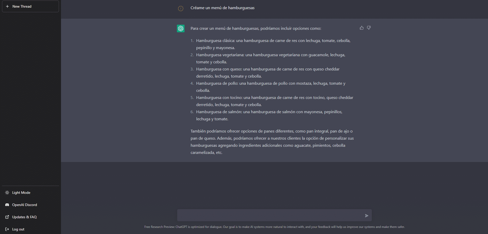

En las últimas semanas, se han abierto al público múltiples inteligencias artificiales, una de las que más me ha llamado la atención ha sido la que te voy a contar a continuación, ChatGPT.

ChatGPT es un modelo de lenguaje creado por OpenAI. Es una herramienta capaz de generar texto de forma autónoma, **imitando el lenguaje natural humano**. Está entrenado en una gran cantidad de datos y puede ser utilizado para ayudar a los clientes de varias maneras.

Una de las principales funcionalidades de ChatGPT es su capacidad para responder preguntas de manera rápida y precisa. Si un cliente tiene alguna duda sobre un producto o servicio, ChatGPT puede proporcionar una respuesta precisa y detallada en cuestión de segundos. Esto puede ayudar a ahorrar tiempo y esfuerzo tanto para el cliente como para el equipo de soporte. Sabiendo esto, decidí preguntarle que me hiciera un menú detallado con varias hamburguesas:

Así que si quieres montar una hamburguesería, ¡de nada!

Otra forma en que ChatGPT puede ayudar a los clientes es proporcionando asistencia personalizada. Gracias a su capacidad para generar texto de forma autónoma, ChatGPT puede adaptarse a las necesidades individuales de cada cliente y proporcionar información y consejos relevantes y precisos. Esto puede mejorar la experiencia del cliente y aumentar su satisfacción.

Sabiendo el potencial que tiene esta herramienta y lo vago que soy, le demandé que me creara un trivial, ya que en la época de navidad, mi familia y yo solemos jugar a juegos de mesa.

Cómo podrás observar, es una herramienta muy útil, y eso que lo he usado para consultas relativamente sencillas. Esto es sólo el comienzo para ChatGPT, cuanto más tiempo pase y más usuarios activos tenga, responderá a las preguntas con mayor acierto.

ChatGPT también puede ser utilizado para mejorar la eficiencia del equipo de soporte. Al liberar a los agentes humanos de tareas repetitivas y de bajo valor añadido, como responder preguntas frecuentes, ChatGPT puede permitir que el equipo se enfoque en tareas más importantes y de mayor valor añadido. Esto puede ayudar a mejorar la productividad y eficiencia del equipo.

Esto suena muy bien, para nosotros, ya que la tecnología nos ayuda a automatizar procesos y en general a hacer nuestra vida más cómoda, pero supone un problema muy grande, ya que este tipo de herramienta acabarán con el trabajo de muchas personas.

También considero que debemos estar pendientes del próximo movimiento de Google, siendo este el motor de búsqueda más usado en todo en todo el mundo, podríamos ver proximamente un lanzamiento con su propia inteligencia artificial.

Si te pica la curiosidad, te dejo el enlace para que puedas probarla tú mismo. Visita [ChatGPT](https://chat.openai.com/chat).
