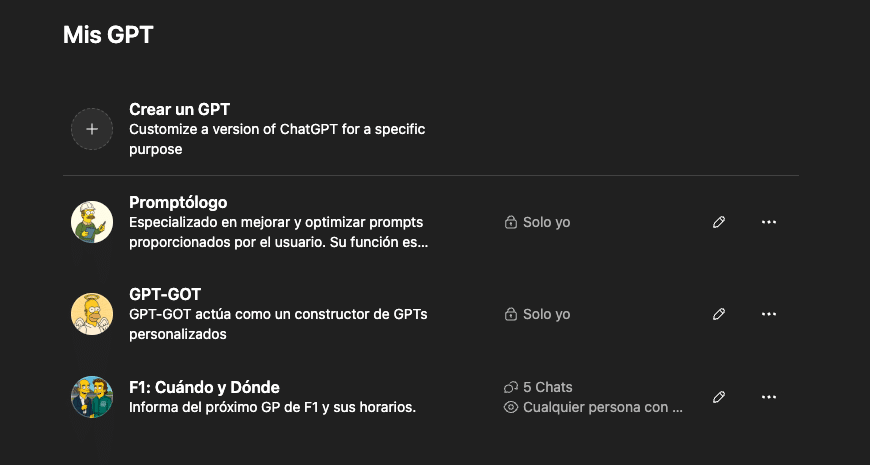

## ¿Qué es un GPT personalizado y por qué deberías crear uno?

Un **GPT personalizado** es como un ChatGPT diseñado por ti. Le puedes dar un rol (por ejemplo, asistente de productividad, redactor de LinkedIn, gestor de correos...), definir cómo debe comportarse y decirle exactamente qué tareas quieres que haga.  
Todo esto se hace **sin código** y en pocos minutos.

Ideal para:

- Emprendedores que quieren automatizar tareas repetitivas.
    
- Estudiantes que necesitan organizarse mejor.
    
- Profesionales que buscan ahorrar tiempo y delegar partes de su trabajo.
    

Es una herramienta de **inteligencia artificial sencilla**, pero muy potente.

¿Te gustaría tener un asistente virtual que entienda tus necesidades y trabaje exactamente como tú quieres? Ahora puedes hacerlo con los **GPTs personalizados de ChatGPT**, una función que te permite crear tu propio modelo de inteligencia artificial sin necesidad de saber programar. En esta guía te explico **paso a paso cómo crear tu primer GPT** y cómo puede ayudarte a **ahorrar tiempo y ser más productivo**, incluso si nunca has usado IA.

## Guía paso a paso: cómo crear tu GPT personalizado en ChatGPT

✅ Paso 1: Entra en ChatGPT y ve a “Explorar GPTs”  
Necesitas tener la versión de pago (ChatGPT Plus). Una vez dentro, haz clic en la pestaña "Explorar GPTs", arriba a la izquierda.

✅ Paso 2: Haz clic en “Crear un GPT”  
Verás un botón que dice “Crear”. Al pulsarlo, se abre un asistente conversacional que te guía.

✅ Paso 3: Define el rol y objetivo de tu GPT  
Por ejemplo: “Eres un asesor que ayuda a autónomos a organizar su semana con foco en productividad”.

✅ Paso 4: Añade instrucciones personalizadas  
Aquí le explicas cómo quieres que responda, qué tono usar, si debe ser breve o detallado, etc.

✅ Paso 5: Ajusta las opciones (opcional)  
Puedes subir archivos, añadir enlaces, dar acceso a herramientas como navegación o código.

✅ Paso 6: Nómbralo, elige una imagen y publícalo  
Ponle un nombre claro (como “Agencia de viajes Gandalf”) y decide si será público o privado.

¡Listo! Ya tienes tu primer GPT personalizado.

## Ejemplos reales de GPTs que he creado (y cómo me ayudan)

Para que veas lo útil que puede ser, aquí tienes algunos **GPTs reales que yo uso a diario**:

🔹 **Promptólogo**  
Especializado en mejorar y optimizar prompts proporcionados por el usuario.

🔹 **GPT-GOT**  
Actúa como un constructor de GPTs personalizados.

🔹 **F1: Cuándo y Dónde**  
Informa del próximo GP de F1 y sus horarios.

Todos estos me **ahorran** **tiempo muy valioso**.

## Preguntas frecuentes sobre GPTs personalizados (FAQ)

**¿Necesito saber programar para crear un GPT personalizado?**  
No. Todo es conversacional y guiado. Puedes hacerlo con simples instrucciones en texto.

**¿Es gratis crear un GPT personalizado?**  
No. Necesitas tener ChatGPT Plus (20 $/mes) para acceder a esta función.

**¿Puedo usarlo desde el móvil?**  
Sí. Todos tus GPTs funcionan igual en la app móvil o en el navegador.

**¿Puedo compartirlo con otros?**  
Sí. Puedes hacerlo público o compartir un enlace privado.

**¿Puedo modificarlo después?**  
Claro. Puedes editar cualquier parte en cualquier momento.

**¿Cuántos GPTs puedo crear?**  
Los que quieras. No hay límite oficial por ahora.

**¿Es seguro usarlo con información privada?**  
Evita incluir datos sensibles. Aunque la plataforma es segura, la precaución siempre es recomendable.
