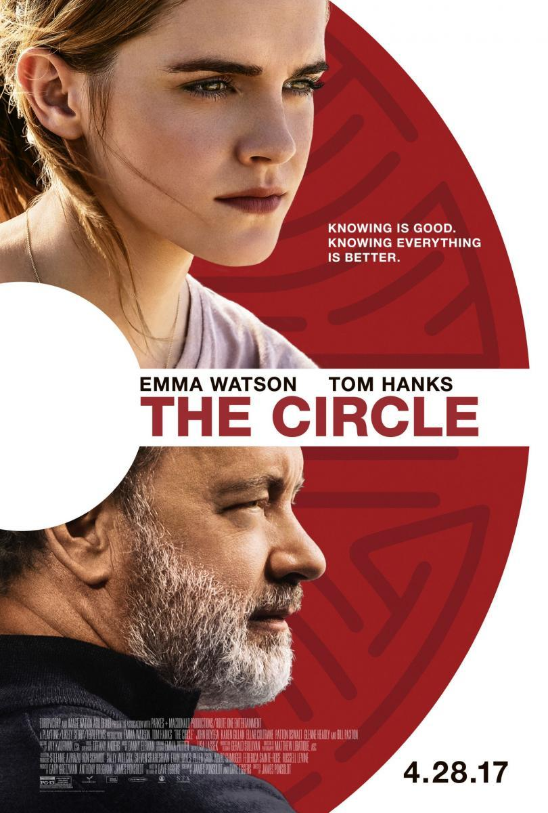

El pasado mes de octubre del año pasado, Marc Zuckerberg, fundador de Facebook, presentó al público un nuevo mundo virtual, llamado Metaverso.

Al ver este proyecto innovador, me recordó a la película que vi hace ya un tiempo, llamada "El Círculo". En la que, con Emma Watson como protagonista, relata la historia de Mae Holland, una chica que es contratada en El Círculo, la mayor empresa de internet y gestión de datos. Al tratarse de la posible oportunidad de su vida, Mae no es capaz de darse cuenta de la absorción por parte de la empresa de su propia persona: a través de la cesión de sus datos como trabajadora, miden no solo su rendimiento, sino sus relaciones y su adaptación en el entorno, si ha asistido a las actividades de «ocio» que propone la empresa, en qué lugar y dónde ha estado a todas horas. ¿Qué empresas pueden o podrían tener una práctica similar?

Tenemos por otro lado a Tom Hanks protagonizando a Eamon Bailey, director y dueño de El Círculo. Una de sus reflexiones que repite de manera constante durante la película es:  "saber es bueno, pero saberlo todo es mejor", pero, curiosamente, solo se sabe de él la mínima información.

Toda esta cesión de datos, es realmente preocupante para el usuario, ya que nadie se lee la política de privacidad cuando accedemos a una página web, o por ejemplo cuando nos descargamos una nueva aplicación. Definitivamente, cuando no pagas por el producto, el producto eres tú.

Recientemente, el fundador de la actual empresa Meta (Facebook, para los boomers), tuvo una disputa con la Unión Europea, esto se debe a la sentencia europea que prohíbe a la compañía tecnológica enviar datos personales de sus clientes europeos a Estados Unidos para procesarlos y almacenarlos fuera del espacio comunitario. Amenazando Marc Zuckerberg con dejar a la Unión Europea sin Facebook ni Instagram.

Volviendo a la película, sorprende que un año después de su lanzamiento, se aprobó la Ley General de Protección de Datos en 2018. Con el objetivo de proteger a los usuarios que navegan por la red.

Las cookies, tecnología más empleada para el seguimiento de los visitantes de un sitio web surgieron gracias a la implantación de esta ley (si has aceptado las cookies en esta web, muchas gracias, a partir de ahora toda tu experiencia en esta web, será observada).

Se preguntarán, ¿qué relación tiene el Metaverso, con el Círculo y las Cookies?, respuesta rápida, los datos personales. Los avances tecnológicos, son un arma de doble filo, por un lado nos ayudan a automatizar y acelerar funciones, y por esa cuestión es genial, pero por otro lado, la sobreexposición en el mundo digital, como le pasa a Emma Watson en la película es realmente peligrosa. La película es muy parecida al mundo que refleja Black Mirror, un mundo en el que vivimos bajo el foco de manera constante.

Además, en la película, vemos un avance en el personaje que interpreta Emma Watson, ya que sufre de lo que se llama FOMO, Fear of Missing Out (la ansiedad por estar desconectado de las redes sociales, provocando así la necesidad de estar siempre conectado y un miedo irracional a la sensación de estar perdiéndose algo).

No quiero desgranarte el largometraje, te invito a que veas la película y saques tus propias conclusiones, la podrás encontrar en Amazon Prime Video.

Si quieres informarte más sobre esta película y su relación con Meta te invito a pasarte por la web de [Almudena Ruiz Calero](http://www.almudenaruizcalero.com/).

Muchas veces no nos damos cuenta de que los medios nos avisan de una posible realidad que podría acontecer, o que, muchas veces, ya está aconteciendo de alguna manera, y parece que un día despiertas y te pilla todo de sorpresa.

¿Alguien hoy en día sabría definir exactamente qué es «Meta»? ¿Sabes qué es lo que realmente pasa detrás de esos banners de una página que te pide que aceptes las cookies? ( la verdadera pregunta es si alguien se lee alguna vez la política de privacidad, pero no podemos evitar como seres humanos ir a toda velocidad). ¿ Por qué esta pelea entre el Mark Zuckerberg y la UE con la cesión de una base de datos llena de correos e información sobre miles de millones de usuarios?

Todas esas preguntas me vinieron a la cabeza una vez vista la película de «El Círculo», en la que, con Emma Watson como protagonista, relata la historia de Mae Holland, una chica que es contratada en El Círculo, la mayor empresa de internet y gestión de datos. Al tratarse de la posible oportunidad de su vida, Mae no es capaz de darse cuenta de la absorción por parte de la empresa de su propia persona: a través de la cesión de sus datos como trabajadora, miden no solo su rendimiento, sino sus relaciones y su adaptación en el entorno, si ha asistido a las actividades de «ocio» que propone la empresa, en qué lugar y dónde ha estado a todas horas. ¿Qué empresas pueden o podrían tener una práctica similar?

Tenemos por otro lado a Tom Hanks protagonizando a Eamon Bailey, director y dueño de El Círculo. Una de sus reflexiones que repite de manera constante durante la película es:  "saber es bueno, pero saberlo todo es mejor", pero, curiosamente, solo se sabe de él la mínima información.

Es curioso como, un año después, acontecería lo siguiente: La aprobación de la Ley General de Protección de Datos en 2018 (un año después de que saliera la película, curiosamente), que protege precisamente tu información como usuario mientras navegas por una página web.

Las cookies son la tecnología más empleada para el seguimiento de los visitantes de un sitio web, así como para recopilar y compartir sus datos con diversos fines, como recordar los datos de inicio de sesión o el contenido de la cesta de la compra, por ejemplo. Pero las cookies son también ampliamente conocidas por ser poco respetuosas con la privacidad, ya que los datos que recopilan de los usuarios y que comparten con terceros van desde información anonimizada hasta datos verdaderamente privados y sensibles, como por ejemplo la información de tu dirección ( seríamos como Mae en este caso).

Gracias a la ley orgánica de protección de datos, como usuarios, estamos más protegidos a la hora de actuar dentro de las páginas web.

Es quizá por lo que Marc Zuckemberg lo tiene difícil a la hora de recopilar todos esos datos de Europa. Toda la amenaza que habrás visto en estas últimas semanas sobre la desaparición definitiva de Instagram y Facebook en Europa, fue solo una falacia (o rabieta) por parte de Zuckemberg por no conseguir su objetivo.

¿Será que el poder se basa ahora en quién llega antes en conseguir la mayor recopilación de datos de esas cookies, que aceptamos tan alegremente?; ¿ Hasta qué punto somos tan vulnerables con la cesión de nuestros datos?.

¿Y qué hacen, por ejemplo, las empresas de publicidad y marketing para hacer esos anuncios tan especificos cuando navegamos? te cuento el concepto de lo que son las cookies de terceros, en mi siguiente post.

No quiero desgranarte el largometraje, te invito a que veas la película, tranquilo que para esto no tienes que aceptar ningunas «cookies», y saques tus propias conclusiones. La película la podrás encontrar en Amazon Prime Video.

Si quieres informarte más sobre esta película y su relación con Meta te invito a pasarte por la web de [Almudena Ruiz Calero](http://www.almudenaruizcalero.com/).
