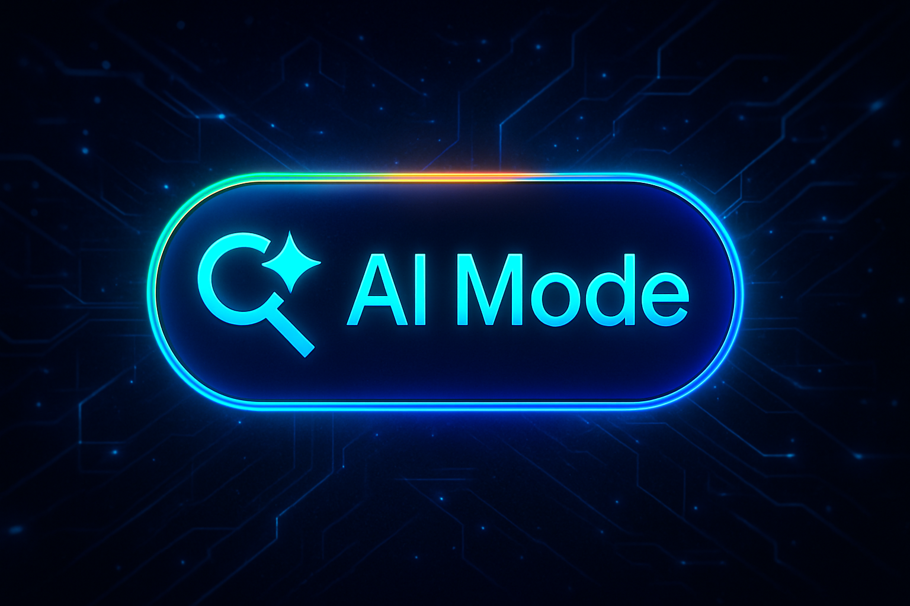

El **Google AI Mode** marca un antes y un después en cómo interactuamos con los motores de búsqueda. Esta innovación introduce una capa de inteligencia que transforma la experiencia del usuario al hacerla más conversacional, personalizada y eficiente. Con el despliegue progresivo de este sistema, estamos asistiendo al inicio de una nueva era en el mundo digital.

A través de esta guía completa, descubrirás **qué es exactamente AI Mode**, cuándo estará disponible en más países, cómo puede afectar al **SEO**, y qué oportunidades se abren para quienes trabajan en la creación de contenido digital.

## ¿Qué es Google AI Mode? Características y beneficios

El nuevo AI Mode está diseñado para ofrecer respuestas más profundas, completas y contextuales, combinando búsqueda tradicional con generación de texto basada en inteligencia artificial. Entre sus principales características, destacan:

- **Interacción multimodal**: integra texto, imágenes y otras formas de contenido en las respuestas.
    
- **Razonamiento contextual**: proporciona resultados basados en el historial de búsqueda y la intención del usuario.
    
- **Respuestas conversacionales**: la experiencia de búsqueda se asemeja a un chat fluido.
    
- **Síntesis informativa**: resume múltiples fuentes en una sola respuesta estructurada.
    
- **Automatización de tareas**: permite ejecutar acciones directamente desde la búsqueda (como redactar correos o planificar eventos).
    

Esta propuesta busca reducir el tiempo que los usuarios dedican a comparar fuentes o profundizar por su cuenta, al entregar resultados mucho más cercanos a una respuesta humana.

## ¿Cuándo se desplegará a nivel mundial y en qué países está activo actualmente?

En este momento, **Google AI Mode** ha comenzado su activación en Estados Unidos como mercado piloto. Esta fase inicial servirá para ajustar el sistema antes de una expansión más amplia.

La hoja de ruta ya contempla una extensión progresiva hacia otras regiones, con especial foco en **Europa** y partes de Asia. Aunque aún no hay fecha definitiva, se espera que el modo AI llegue a más países durante el segundo semestre del año. Su activación depende de factores como la legislación local sobre privacidad, la infraestructura de datos y la compatibilidad lingüística.

## Posibles efectos negativos para el SEO

A pesar del entusiasmo que genera esta nueva funcionalidad, no todo son buenas noticias para quienes dependen del **SEO** como canal principal de tráfico. Algunos de los riesgos potenciales incluyen:

- **Pérdida de visibilidad**: las respuestas generadas por IA podrían sustituir los clics a sitios web tradicionales.
    
- **Reducción del CTR**: especialmente en consultas informativas, donde el usuario podría no necesitar visitar otras páginas.
    
- **Menor control del contenido mostrado**: las fuentes utilizadas para las respuestas no siempre son claramente identificadas.
    
- **Mayor competencia por autoridad**: será más relevante que nunca demostrar experiencia, relevancia y confianza (E-E-A-T).
    
- **Incertidumbre algorítmica**: los cambios continuos en la forma de mostrar los resultados dificultan la planificación a largo plazo.
    

En un análisis más detallado sobre este impacto, puedes consultar [cómo afecta la nueva generación de respuestas al CTR](/blog/noticias/el-impacto-de-google-ai-overviews-en-el-ctr/), donde exploramos en profundidad sus consecuencias en entornos reales.

## Oportunidades para el SEO

Lejos de ser un obstáculo insalvable, **Google AI Mode** puede convertirse también en un aliado estratégico si se entiende su lógica de funcionamiento. Algunas oportunidades destacables:

- **Optimización para resultados de síntesis**: los contenidos bien estructurados y con alto valor informativo tienen más opciones de ser integrados en las respuestas.
    
- **Enfoque en contenido evergreen y educativo**: ideal para alimentar modelos de IA con contenido duradero y bien contextualizado.
    
- **Estrategias basadas en entidades y relaciones semánticas**: ayudan a que los algoritmos comprendan mejor la temática general del sitio.
    
- **Mayor importancia de los datos estructurados**: crucial para destacar frente a otras fuentes.
    
- **Adaptación al estilo conversacional**: escribir para IA implica entender cómo se generan las respuestas, priorizando claridad, contexto y conexión.
    

Además, se abre un campo interesante en lo que respecta a herramientas como **Gmail** o **Gemini**, que podrían integrarse con esta búsqueda asistida para realizar tareas automatizadas en segundos, desde redactar mensajes hasta analizar documentos o agendar reuniones.
