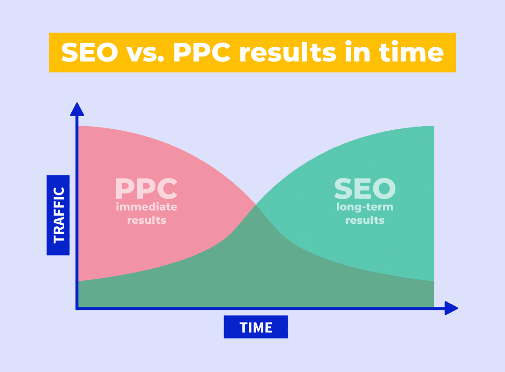

El SEO (Search Engine Optimization) y el SEM (Search Engine Marketing) son dos términos que a menudo se confunden o se utilizan de manera intercambiable. Pero en realidad, ambos términos se refieren a estrategias diferentes de marketing digital, utilizadas para mejorar la visibilidad de un sitio web en los motores de búsqueda.

El SEO se centra en optimizar un sitio web para que sea más atractivo para los motores de búsqueda, con el objetivo de aparecer en los primeros resultados de búsqueda orgánicos. Esto se logra a través de técnicas como la optimización de palabras clave, la creación de contenido de alta calidad y la construcción de enlaces (linkbuilding).

Por otro lado, el SEM se centra en la promoción de un sitio web a través de anuncios pagados en los resultados de búsqueda. Estos anuncios aparecen en la parte superior y/o lateral de los resultados de búsqueda y son una forma rápida y efectiva de aumentar la visibilidad de un sitio web.

Las ventajas de utilizar el SEO incluyen un mayor tráfico orgánico a largo plazo y una mejor experiencia para el usuario, mientras que las ventajas de utilizar el SEM incluyen un control más preciso sobre la visibilidad y el presupuesto, así como resultados más rápidos.

En general, es posible utilizar tanto el SEO como el SEM de manera efectiva para mejorar la visibilidad de un sitio web en los motores de búsqueda. La elección depende de los objetivos específicos de marketing, el presupuesto y el tiempo disponible.

En resumen, el SEO y el SEM son estrategias complementarias que tienen como objetivo mejorar el posicionamiento de un sitio web en los motores de búsqueda, cómo por ejemplo el de Google o Yandex. Cada uno ofrece ventajas únicas y puede ser utilizado para alcanzar objetivos diferentes. Lo importante es entender las diferencias entre ambos y utilizarlos de manera estratégica para lograr los mejores resultados posibles. 

A nivel personal, yo estoy especializado en SEO, de hecho desempeño esta función en mi trabajo, optimizar diferentes páginas webs para que aumenten su autoridad y su presencia en internet. No dudes en [contactar conmigo](/contacto/) si tienes alguna duda.
