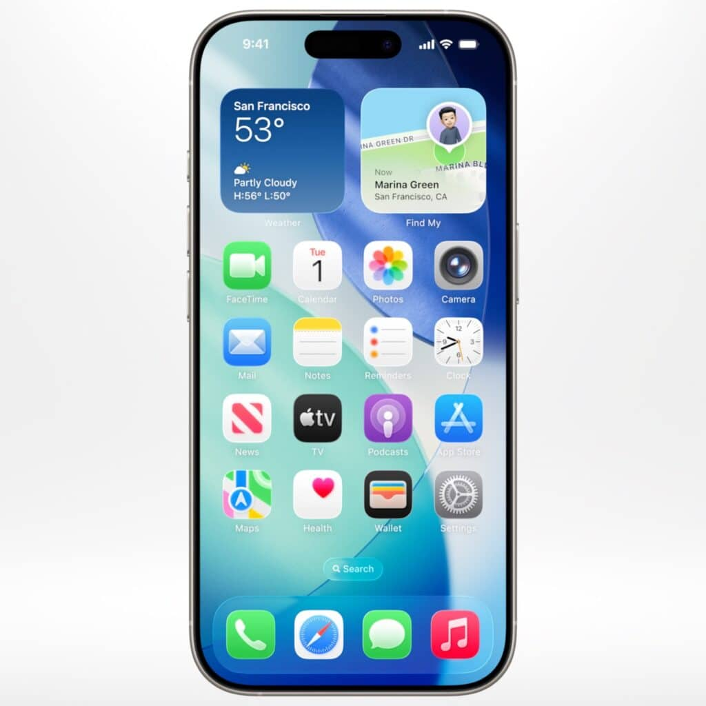

Apple presentó en la WWDC 2025 un nuevo lenguaje visual llamado _Liquid Glass_, unificó la numeración de todos sus sistemas operativos, reforzó su apuesta por la inteligencia artificial con Apple Intelligence, y anunció mejoras en privacidad, automatización y apps clave como Safari y Mensajes.

## DATOS CLAVE Y NOVEDADES DESTACADAS

### 1\. Nuevo lenguaje de diseño: _Liquid Glass_

Apple rediseña toda su interfaz con una estética translúcida, más limpia y profunda.  
**Impacta a**: iOS, iPadOS, macOS, watchOS, tvOS y visionOS.  
**Cambios visibles**: Pantalla de bloqueo inteligente, nuevos iconos, Centro de Control renovado.

### 2\. Unificación de versiones

Apple abandona los números secuenciales:  
Ahora tendremos **iOS 26, macOS 26, visionOS 26**, etc.  
Facilita la comprensión de versiones y alinea todos los sistemas bajo un mismo año.

### 3\. Avances en IA: _Apple Intelligence_

- Siri mejora su contexto y precisión.
    
- Traducción en tiempo real en **Mensajes, FaceTime y Teléfono**.
    
- Nuevos **Genmoji personalizados** generados con tecnología de ChatGPT.
    
- Detección de spam automática en Mensajes.  
    🔐 Todo se procesa localmente: privacidad garantizada.
    

### 4\. Automatización avanzada en macOS

- Nuevos flujos de trabajo personalizados.
    
- Integración con accesos directos, apps del sistema y acciones condicionales.  
    Ideal para usuarios avanzados y profesionales creativos.
    

### 5\. Mejoras en apps y funciones

- **Cámara** y **Safari** reciben rediseños con nuevas capacidades.
    
- **Apple Watch** suma funciones de salud y deporte.  
    No hubo apps nuevas de gran impacto, pero sí una clara mejora continua.
    

* * *

## Conclusión

Apple busca consolidar su ecosistema con un diseño coherente, inteligencia artificial útil pero ética, y herramientas más potentes para usuarios avanzados.  
Este enfoque responde tanto a la presión del mercado (Google y Microsoft avanzan rápido en IA) como a su diferenciación histórica: diseño, privacidad y control local.
