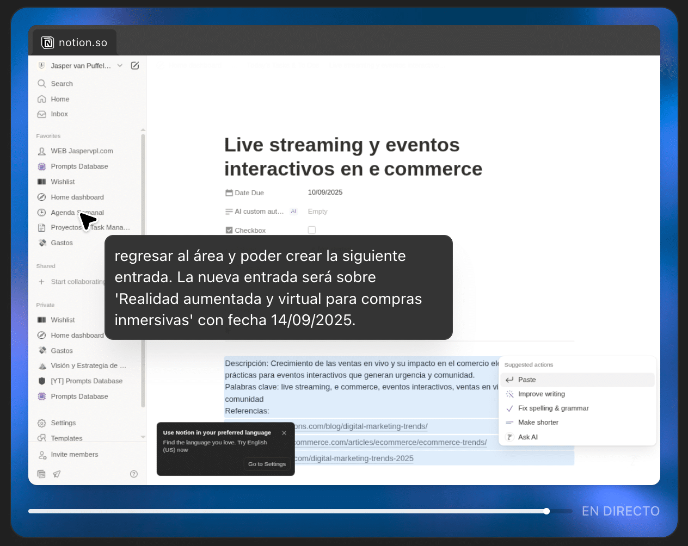

Een **ChatGPT Agent** is een assistent die meerstaps taken kan plannen en uitvoeren en context onthouden tussen sessies. Hij gebruikt tools zoals een visuele browser, code-uitvoering, connectors en geïntegreerd geheugen.

### Wat kan ChatGPT Agent doen?

- Navigeert op internet: klikt, scrolt, vult formulieren in en downloadt bestanden.
- Voert geïnterpreteerde code uit (Code Interpreter) om gegevens te analyseren.
- Voert diepgaand informatieonderzoek uit over meerdere bronnen (deep research) en vat samen.
- Maakt automatisch spreadsheets, presentaties en rapporten.
- Verbindt met externe diensten (Gmail, Notion, GitHub) met toestemming van de gebruiker.
- Plant taken zoals contentkalenders of reserveringen, met bevestiging voordat kritieke wijzigingen worden doorgevoerd.

## ¿Waarin verschilt hij van Operator?

- Lancering: Operator werd gelanceerd in januari 2025 (Pro-preview); ChatGPT Agent in juli 2025 voor Pro/Plus/Team (later voor Enterprise/Education).
- Visuele navigatie: Operator heeft een eenvoudige ingebouwde browser (klikken, scrollen, typen in een geïsoleerde omgeving). ChatGPT Agent heeft volledige geïntegreerde browserfunctionaliteit met risicovalidatie en een “watch”-modus.
- Onderzoek: Operator kan beperkt informatie opzoeken; ChatGPT Agent voert geavanceerd onderzoek uit met diepe synthese van informatie en genereert uitgebreide rapporten.
- Autonomie: Operator voert specifieke taken uit die je hem geeft; ChatGPT Agent kan zelfstandig complete workflows plannen en uitvoeren.
- Geheugen & context: Operator heeft geen langdurig geheugen; ChatGPT Agent onthoudt context tussen taken en sessies.
- Risico & veiligheid: Operator vraagt om eenvoudige bevestigingen en is beperkt tot browsen;
- ChatGPT Agent heeft een waakzaamheidsmodus, ingebouwde blokkeringen en extra bevestigingen voor kritieke acties voor meer veiligheid.

## Mijn persoonlijke ervaring met ChatGPT Agent

Onlangs heb ik de agent gebruikt om een contentkalender voor mijn blog op te stellen met een frequentie van elke 3 dagen en voor een periode van 3 maanden. De ChatGPT Agent begon met online

onderzoek naar mogelijke onderwerpen, verzamelde deze vervolgens in een Excel-bestand en voegde ze daarna toe aan mijn persoonlijke Notion (specifiek in mijn wekelijkse agenda).

Dankzij deze aanpak kreeg ik een publicatiekalender voor drie maanden. Mijn Notion werd automatisch bijgewerkt, maar steeds pas na mijn goedkeuring. Ik kon elke stap in real time controleren en aanpassen voordat de agent de wijzigingen doorvoerde.

## Conclusie

  
ChatGPT Agent is de natuurlijke evolutie van Operator, met integratie van webnavigatie en  
diepgaand onderzoek. Zijn autonomie maakt hem nuttig voor complexe taken – maar altijd onder jouw toezicht en met  
voortdurende validatie!Mijn test met Notion liet zien dat hij veilig, efficiënt en collaboratief werkt, waarbij jij centraal  
staat.  

Meer informatie:[https://openai.com/es-419/index/introducing-operator/](https://openai.com/es-419/index/introducing-operator/)
